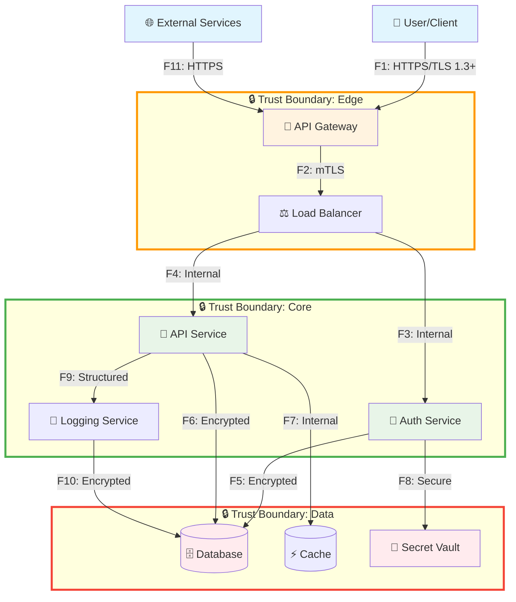
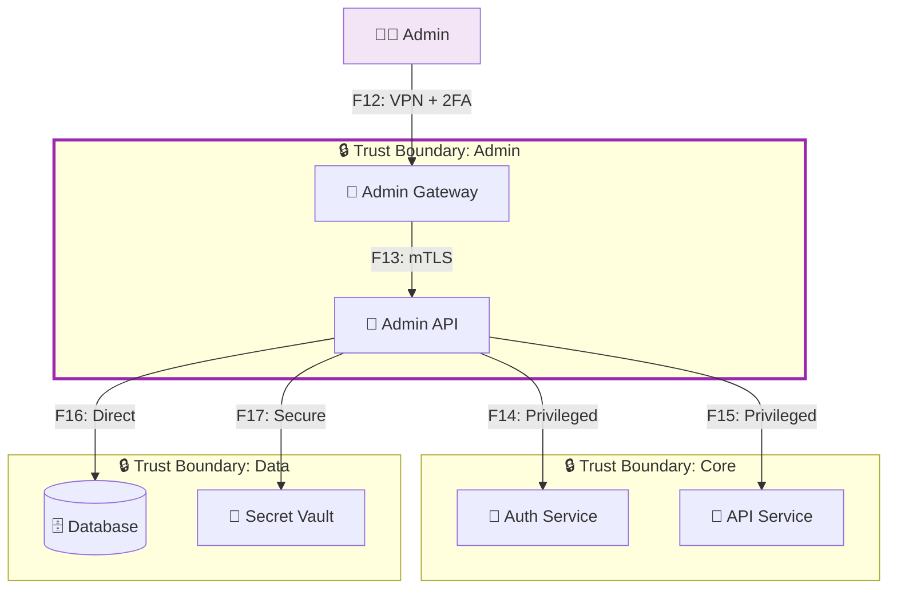

# Data Flow Diagram (DFD)

## Обзор
Данный документ содержит Data Flow Diagram для SecDev Course Project с обозначением границ доверия и потоков данных.

## Основная диаграмма

## Список потоков данных

| ID | Откуда → Куда | Канал/Протокол | Данные/PII | Комментарий |
|----|---------------|-----------------|------------|-------------|
| F1 | User → API Gateway | HTTPS/TLS 1.3+ | Credentials, PII | Публичный доступ |
| F2 | API Gateway → Load Balancer | mTLS | Session tokens | Внутренняя сеть |
| F3 | Load Balancer → Auth Service | Internal | Auth requests | Микросервис |
| F4 | Load Balancer → API Service | Internal | API requests | Микросервис |
| F5 | Auth Service → Database | Encrypted | User data, PII | Критичные данные |
| F6 | API Service → Database | Encrypted | Business data | Критичные данные |
| F7 | API Service → Cache | Internal | Session data | Временное хранение |
| F8 | Auth Service → Secret Vault | Secure | Secrets, keys | Управление секретами |
| F9 | API Service → Logging Service | Internal | Logs, metrics | Мониторинг |
| F10 | Logging Service → Database | Encrypted | Audit logs | Аудит |
| F11 | External Services → API Gateway | HTTPS | API calls | Внешние интеграции |

## Границы доверия

### Edge (Граница сети)
- **Компоненты**: API Gateway, Load Balancer
- **Угрозы**: DDoS, Brute force, Injection attacks
- **Контроли**: Rate limiting, WAF, DDoS protection

### Core (Ядро системы)
- **Компоненты**: Auth Service, API Service, Logging Service
- **Угрозы**: Privilege escalation, Data tampering
- **Контроли**: Authentication, Authorization, Input validation

### Data (Граница данных)
- **Компоненты**: Database, Cache, Secret Vault
- **Угрозы**: Data breach, Unauthorized access
- **Контроли**: Encryption, Access controls, Audit logging

## Альтернативный сценарий: Административный доступ

## Ключевые потоки для анализа угроз

### Критичные потоки (высокий приоритет)
- **F1**: User → API Gateway (публичный доступ)
- **F5**: Auth Service → Database (PII данные)
- **F8**: Auth Service → Secret Vault (секреты)
- **F10**: Logging Service → Database (аудит)

### Средний приоритет
- **F2**: API Gateway → Load Balancer
- **F6**: API Service → Database
- **F9**: API Service → Logging Service

### Низкий приоритет
- **F7**: API Service → Cache
- **F11**: External Services → API Gateway
